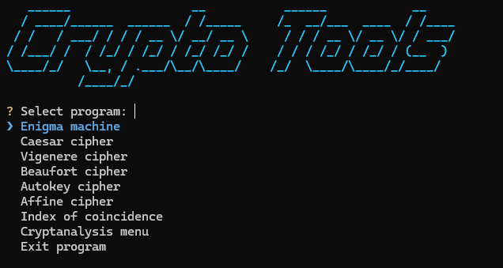
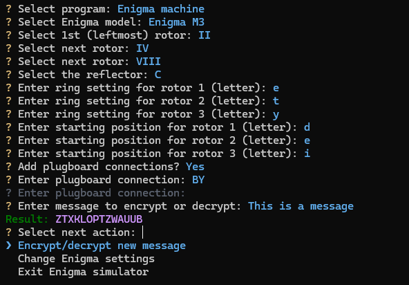

# CryptoTools

CryptoTools is a terminal user interface implementing classical ciphers like Caesar or Vigenere cipher, as well as the Enigma machine.
It has some cryptanalysis features for breaking simple ciphers.

It currently supports:
 - Enigma machine
 - Caesar cipher
 - Affine cipher
 - Vigenere cipher and its variants: Beaufort cipher and autokey/autoclave cipher
 - Index of coincidence calculating
 - Cryptanalysis of several ciphers:
    - Caesar cipher
    - Affine cipher
    - Vigenere cipher (including key length finding)

## Usage

Run `global_interface.py` in `src` folder.\
Use the `up` and `down` arrow keys to navigate in the menus and press `enter` to confirm a choice.\
Pressing `Control-C` exits the current interface.

## Dependencies

 - `InquirerPy` used for making the interactive command-line interface
 - `pyfiglet` used for displaying the title at the beginning

[dCode](https://www.dcode.fr/en) website was really useful for verifying my results and finding letters/bigrams/trigrams frequencies.